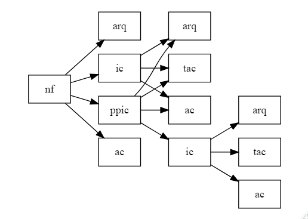
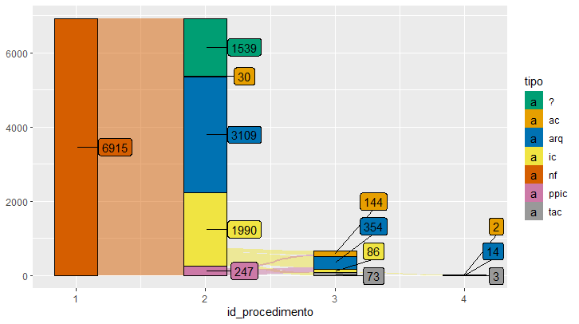
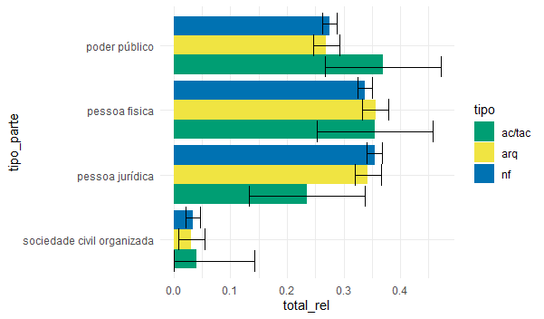
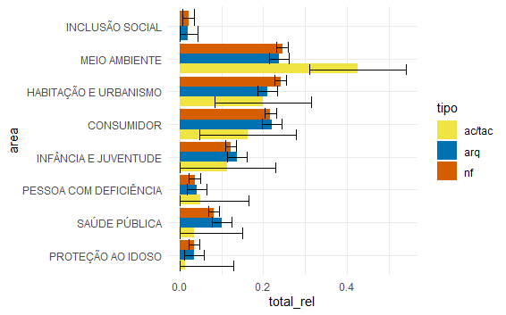

# Quem sou eu 

```{r setup, include=FALSE}
knitr::opts_chunk$set(
  echo = FALSE,
  fig.align = "center",
  out.width = "90%",
  message = FALSE,
  warning = FALSE,
  dpi=300
)
```

```{r xaringan-themer, include=FALSE, warning=FALSE}
library(xaringanthemer)
style_mono_accent(
  base_color = "#EFA76C",
  background_color = "#F5E395",
  header_color = "#4B76AD",
  text_bold_color = "#000000",
  header_font_google = google_font("Josefin Sans"),
  text_font_google   = google_font("Montserrat", "300", "300i"),
  code_font_google   = google_font("Fira Mono")
)
```

.pull-left[
Estudante de Direito na Universidade de São Paulo (USP)

Ex-bolsista do Programa de Educação Tutorial do MEC (PET - Sociologia Jurídica)

Pesquisador na Associação Brasileira de Jurimetria (ABJ)
]

.pull-right[]

---
class: center, middle

## Independência funcional e discricionariedade burocrática do Ministério Público
#### Como que a independência funcional se converte em discricionariedade para os membros do MP na prática?
---
# Metodologia

O primeiro passo era identificar e descrever o fluxo de processamento de casos do Ministério Público. Isso significa: quando o MP recebe uma demanda, como ele reage a isso? 

Feito isso, eu identifiquei gargalos nesse procedimento em que os promotores tinham certa discricionariedade no caso, em que eles podiam escolher para que lado o processo ia seguir. 

Identificados os gargalos, coletei dados para avaliar a forma como a discricionariedade era exercida. 

A questão não era tanto _se_ os promotores eram discricionários ou não, mas era _qual é a forma dessa discricionariedade?_. Com isso eu queria avaliar se a discricionariedade significa que os promotores escolhiam _no que_ e _quando_ agir; ou se era uma discricionariedade simplesmente de _como_ agir. 

## E onde o R entra nisso?

A forma como eu estudei isso foi através de uma metodologia quantitativa, realizando testes de hipóteses para avaliar minhas hióteses

---

## O ciclo da Ciência de Dados

```{r echo=FALSE, eval=TRUE}

knitr::include_graphics("img/data-science.png")

```

## Como eu me situei nesse ciclo?

- Importação, limpeza e tratamento dos dados
- Testes de hipótese
- Visualização

---
# Importação: Conhecendo seus dados e importando a base

A primeira etapa é saber o processo por meio do qual os dados foram gerados.

>_sem essa informação, nós não podemos determinar se utilizar processos padrões de análise de dados irá produzir inferências enviesadas. Somente ao saber do processo por meio do qual os dados foram gerados é que nós conseguiremos produzir uma inferência causal ou descritiva válida._

KING, Gary; KEOHANE, Robert O.; VERBA, Sidney. **Designing Social Inquiry: Scientific Inference in Qualitative Research.** Princeton: Princeton University Press. 1994, p. 23

No meu caso, os dados que eu utilizei foram dados do **SIS MP Integrado**, que é um sistema de registro de procedimentos, e não um sistema de acompanhamento de casos. 
- Esses dados eram registrados pelos próprios promotores (e, portanto, continham erro humano e variabilidade); 


---
## Limpeza: Escolhas metodológicas
### Quais procedimentos considerar?

O problema era: havia vários procedimentos em 2019. Alguns procedimentos de 2019 tinham origem em anos anteriores; e outros procedimentos tinham origem em 2019 mesmo. Como eu filtro esses procedimentos? 

### Como classificar as parte? Regex de partes

| tipo de pessoa             | regex                                                                 |
|----------------------------|-----------------------------------------------------------------------|
| pessoa física              | idêntico à base original                                              |
| pessoa jurídica            | Ltda, SA, ME, EPP, Construtoras, Imobiliarias, etc...                 |
| poder público              | Prefeitura, Município, Polícia, CET, CETESB, Secretaria, SABESP, vara |
| sociedade civil organizada | Associação, Conselhos, Amigos do Bairro, Federação, GAEMA             |

---
# Visualização: Elaboração de diagramas!

```{r echo=FALSE, eval=TRUE, out.width="85%"}



```

---
# Visualização: Gráficos de fluxos (sankey plot)

```{r echo=FALSE, eval=TRUE}



```

---
# Modelagem e visualização: Visualizando testes de hipótese
```{r echo=FALSE, eval=TRUE}



```


---
# Modelagem e visualização: Visualizando testes de hipótese

```{r echo=FALSE, eval=TRUE}



```

---
class: center, middle, inverse

# FIM

```{r echo=FALSE, eval=TRUE}


```


